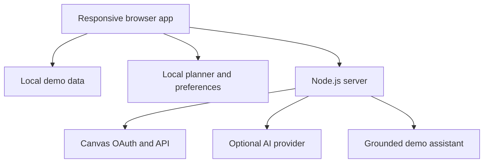

# JARVIS Student Companion

JARVIS is a voice-first academic dashboard that turns scattered course data into decisions: what to do next, how a grade could change, when to study, and whether a campus event actually fits.

The project includes a complete privacy-safe demo, so it works immediately after cloning and can be published as a static GitHub Pages showcase. A dependency-free Node.js server adds optional Canvas OAuth and AI-assisted responses.

## Why it is different from Canvas

- **Workload triage** detects deadline collisions and late-deadline/early-class sleep risks.
- **Grade forecasting** calculates current, projected, and required scores from syllabus weights.
- **Study-session generation** divides an assignment into realistic blocks working backward from its deadline.
- **Free-time matching** checks campus events against classes, focus blocks, and nearby deadlines.
- **Wellbeing check-ins** adjust planning guidance without sending the response off-device.
- **Voice interaction** supports browser speech recognition and system text-to-speech.
- **Grounded assignment help** uses the loaded assignment context and falls back to a deterministic local assistant.

## Demo features

| Area | What works |
| --- | --- |
| Overview | Priority recommendation, progress, estimated workload, deadline triage, sleep warning, wellbeing check-in |
| Assignments | Search, course/status filters, detailed briefs, completion tracking |
| Planner | Auto-ranked queue, custom focus blocks, generated study sessions, local persistence |
| Grade forecast | Course-specific syllabus weights, what-if final score, target-grade calculator |
| Campus | Event discovery and schedule/deadline conflict checks |
| Voice | Speech-to-text questions, selectable system voice, spoken answers |
| Integrations | Safe demo data by default; optional Canvas OAuth and Anthropic API on the server |

## Quick start

Requirements: Node.js 18.17 or newer. No packages need to be installed beyond the project metadata.

```bash
git clone <your-repository-url>
cd jarvis-student-companion
npm ci
npm start
```

Open [http://localhost:3000](http://localhost:3000). The app starts in demo mode with no API keys or university login.

Run all checks:

```bash
npm run verify
```

For automatic server restarts during development:

```bash
npm run dev
```

## Publish the static demo on GitHub Pages

The included Pages workflow publishes only `public/`, which contains the safe client-side showcase.

1. Push the repository to GitHub with `main` as the default branch.
2. Open **Settings → Pages** in the repository.
3. Set **Source** to **GitHub Actions**.
4. Run or wait for **Deploy static demo to GitHub Pages**.

The static demo supports every local feature, including grade forecasting, study planning, event matching, and the rule-based assistant. Canvas OAuth and external AI require the Node server because secrets must never be placed in GitHub Pages browser code.

## Optional Canvas OAuth

Canvas integration requires an OAuth developer key approved by the institution that operates the Canvas instance.

```bash
cp .env.example .env
```

Update `.env`:

```env
CANVAS_BASE_URL=https://canvas.example.edu
CANVAS_CLIENT_ID=your_client_id
CANVAS_CLIENT_SECRET=your_client_secret
CANVAS_REDIRECT_URI=http://localhost:3000/auth/canvas/callback
```

Register the same redirect URI in the Canvas developer-key configuration, restart JARVIS, and use **Settings → Manage Canvas**.

The browser never receives the client secret or Canvas access token. The current server stores sessions in memory, so restarting it signs users out. A production deployment should use encrypted persistent sessions, HTTPS, token refresh/revocation, institutional review, and a durable database.

## Optional AI responses

Demo mode does not need an AI provider. To use Anthropic, add these values to `.env`:

```env
AI_PROVIDER=anthropic
ANTHROPIC_API_KEY=your_key
AI_MODEL=a_model_available_to_your_account
```

Requests are sent by the server, not the browser. Assignment context is limited and HTML is stripped before it is included. If the provider is unavailable, the browser falls back to the local assistant.

## Customize the showcase

Edit [`public/data/demo-data.json`](public/data/demo-data.json) to change:

- the demo student profile;
- courses and assignments;
- grade categories and syllabus weights;
- class/focus schedule;
- campus events.

Assignment and event dates use offsets from the day the demo is opened, so the showcase does not go stale.

## Architecture



The server uses only Node.js built-ins and the native `fetch` API. This keeps setup fast, reduces supply-chain risk, and makes the repository easy to audit.

## Project structure

```text
public/                 Browser application and safe demo data
src/                    Server configuration, Canvas, AI, and HTTP modules
tests/                  Node test-runner coverage
.github/workflows/      CI and GitHub Pages deployment
server.js               Application server and API routes
.env.example            Secret-free configuration template
```

## Security and privacy

- `.env` is ignored by Git.
- OAuth state is verified on callback.
- Access tokens remain in HTTP-only server sessions.
- The server adds a restrictive Content Security Policy and related security headers.
- Chat requests are size-limited and rate-limited.
- Browser-rendered Canvas/demo values are inserted as text, not trusted HTML.
- Planner items, completion state, voice choice, and wellbeing check-ins remain in local browser storage.

See [SECURITY.md](SECURITY.md) for reporting and deployment guidance.

## Roadmap

- Syllabus document ingestion with cited policy answers
- Encrypted persistent accounts and cross-device sync
- Opt-in friend availability groups with granular privacy controls
- Calendar provider integrations
- Instructor-configurable grading rules, dropped scores, and curves
- Accessible mobile notifications and deadline nudges

## License

MIT
